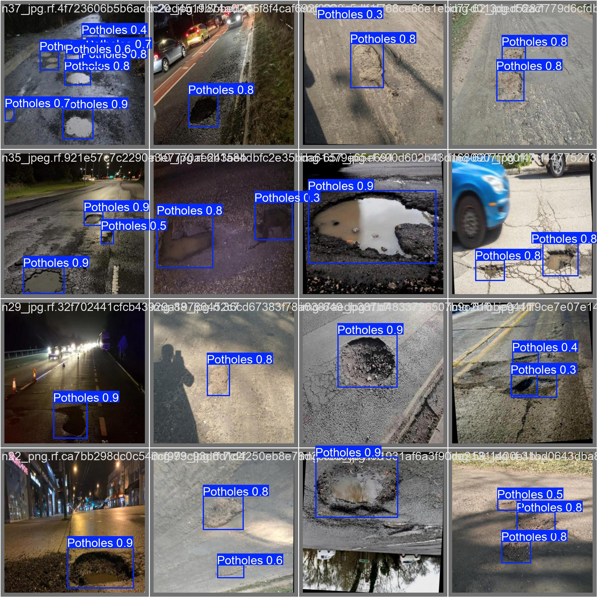
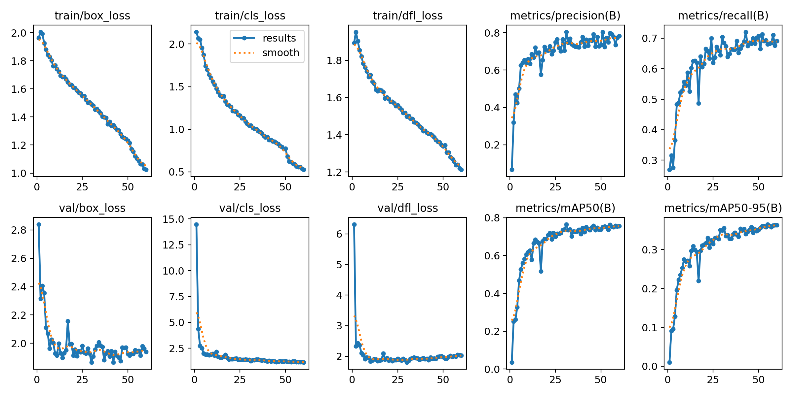
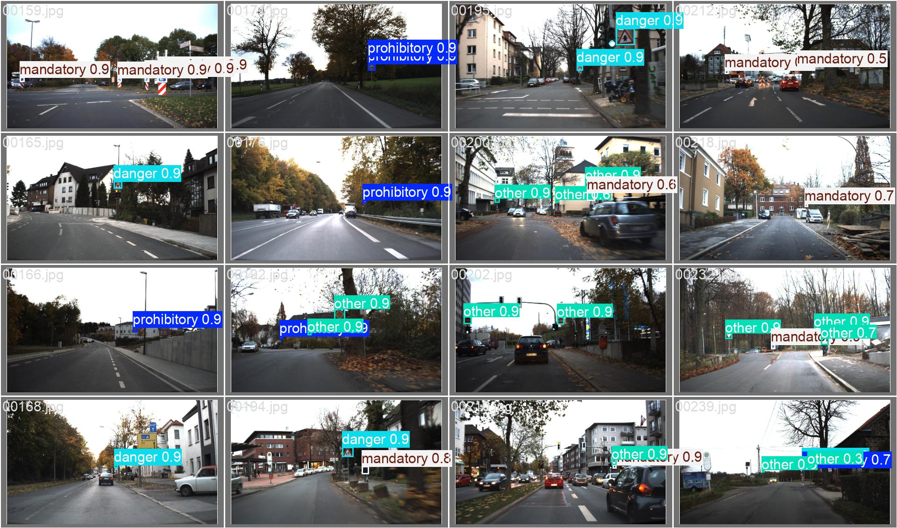
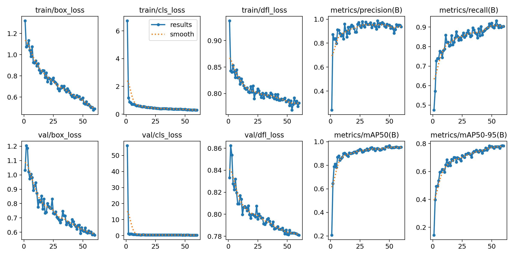

# Training YOLO models

Setup and training scripts for YOLO-based computer vision models

## Setup

1. Install dependencies:
```bash
python -m venv .venv
.venv\Script\activate
uv sync
```
2. For training: 
   - With Kaggle dataset: `python scripts/main.py --dataset <kaggle-handle> --nc <num-classes> --names <class-names>`
   - With local dataset: `python scripts/main.py --local-dataset <path-to-dataset> --nc <num-classes> --names <class-names>`
3. For inference: Run `python scripts/inference.py --model <model-path> --input <image/video/webcam>`
4. For evaluation: Run `python scripts/evaluate.py --model <model-path> --data <data.yaml> --split test`

```bash
cd .\scripts\
# Kaggle dataset
python main.py --dataset "jocelyndumlao/multi-weather-pothole-detection-mwpd" --nc 1 --names "Potholes" --epochs 1 --name "yolo_train_demo_potholes_e1_b32"

# local dataset
python main.py --local-dataset "C:\path\to\dataset" --nc 1 --names "Potholes" --epochs 60 --name "yolo_train_local"

# inference (image, folder, video, webcam)
python inference.py --model ".\runs\train\yolo_train_demo_potholes_e1_b32\weights\best.pt" --input <path_image.jpg/path_video.mp4/'webcam'>

# evaluation on test set
python evaluate.py --model ".\runs\train\yolo_train_demo_potholes_e1_b32\weights\best.pt" --data ".\MWPD.yaml" --split test
```

- *jocelyndumlao/multi-weather-pothole-detection-mwpd*: val_batch0_pred.jpg; results.png
<p style="text-align: center;">
  
  
</p>

- *valentynsichkar/traffic-signs-dataset-in-yolo-format*: val_batch1_pred.jpg; results.png
<p style="text-align: center;">

  
</p>
